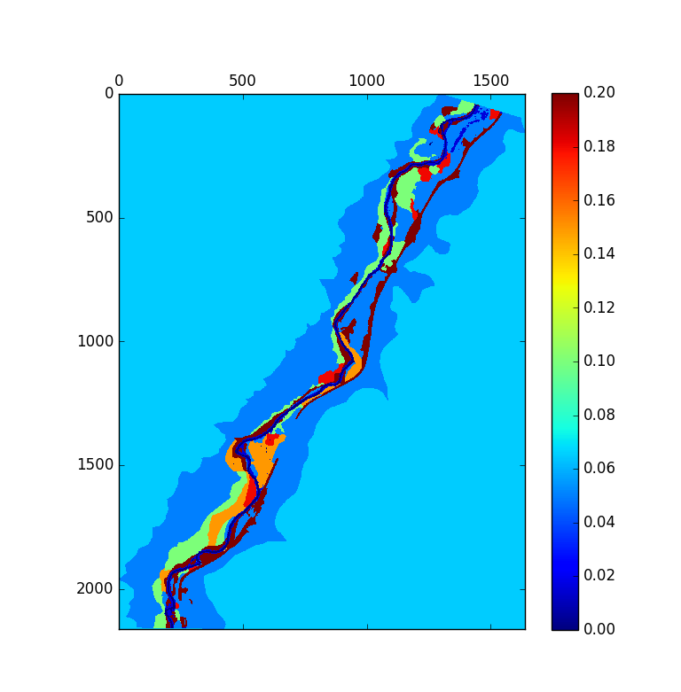

# vw-RipCAS-DFLOW

Functions for running our Riparian Community Alteration and Succession model, RipCAS, and D-FLOW coupled.
We are still in the process of changing names from casimir -> ripcas as we move from the [CASiMiR vegetation model, which is closed-source and windows-only](www.casimir-software.de/ENG/veg_eng.html) to our own open-source version, [RipCAS](https://github.com/VirtualWatershed/vw-ripcas-dflow/blob/master/ripcas_dflow/ripcas_dflow.py#L54).

First we show some use instructions then installation instructions.

# Usage

## API usage

### Coupled ModelRun

Here is an example of using the ModelRun class to set up and execute the coupled
DFLOW/RipCAS model:

```python
import matplotlib.pyplot as plt

from ripcas_dflow import ModelRun, veg2n

mr = ModelRun()

# assume we have read these from a file or elsewhere; set them here for ex
peak_flow = 89.55
streambed_roughness = 0.04
reach_slope = 0.001

geometry = Pol.from_river_geometry_file('data/DBC_geometry.xyz')

mr.calculate_bc(peak_flow, geometry, streambed_roughness, reach_slope)

assert mr.bc_converged

mr.run_dflow('data/dflow-test/', 'data/vegclass_2z.asc')

# the output is an ESRIAsc map of vegetation type (coded integer)
out = mr.run_ripcas('data/zonemap_2z.asc', 'data/casimir-data-requirements.xlsx', 'data/ripcas-test')

# translate to Manning's roughness map, which shows communities a little better
n_out = veg2n(out)

plt.matshow(n_out.as_matrix(replace_nodata_val=0.0))
plt.colorbar()
```



### Boundary Condition Solver

We provide a solver for boundary conditions which can be used as follows. There
is some data in the `data/` directory that we use.

The boundary condition we have to calculate is actually an inverse problem. We
are given the peak flow for a given year, but we don't know what the elevation
of the water surface (WS elevation) is at the bottom of the reach under consideration. DFLOW
needs this as a boundary condition, as well as the streamflow that is associated
with the WS elevation, or just WS for short. We use
[scipy.minimize_scalar](http://docs.scipy.org/doc/scipy/reference/generated/scipy.optimize.minimize_scalar.html)
to accomplish this inverse problem. See the
[source code](https://github.com/VirtualWatershed/vw-ripcas-dflow/blob/master/ripcas_dflow/modelrun.py#L357)
for more details.

```python
from dflow_casimir import BoundaryConditionSovler, Pol

# these are variables we would probably read from a file
target_streamflow = 89.55  # the first value in data/peak.txt
streambed_roughness = 0.04  # empirical n value
reach_slope = 0.001

# use our Pol (polygon) object used for xyz/polygon file dialects of interest
geometry = Pol.from_river_geometry_file('data/DBC_geometry.xyz')

bc_solver = BoundaryConditionSover(target_streamflow,
                                   geometry,
                                   streambed_roughness,
                                   reach_slope)

bc_solution = bc_solver.solve()

print bc_solution
```

Will yield the `BoundaryConditionResult` printing

```
BoundaryConditionResult(ws_elev=1777.3393782057494,
streamflow=89.549822073608453, error=0.00017792639154379231, success=True)
```

which shows that for the given streamflow of 89.55 cubic meters per second,
the WS elevation is 1777.3394 meters. The absolute error between calculated
streamflow (89.549822...) and observed streamflow is 0.0002, or a relative error of
0.0002/89.55 = 2.23e-6.


## Command-line scripts

To get the first .pol of n-values for use in the first D-FLOW run, use the
`jemez/veg2npol.py` script. For example, if the vegetation ESRI .asc is
`data/vegclass_2z.asc` and we want to write our .pol of n-values to
`initial_n.pol`, we would run

```
python jemez/veg2npol.py data/vegclass_2z.asc initial_n.pol
```

To run RipCAS to use D-FLOW inputs and output a .pol of n-values, use
the `jemez/dflow_casimir.py` script. For example, if the path to the
output netCDF with shear stress from D-FLOW is `data/jemez_r02_map.nc`
and the path to our vegetation map is `data/vegclass_2z.asc`, we would
run (not)casimir by running

```
python jemez/dflow_casimir.py ~/local_data/dflow_outputs/jemez_r02_map.nc ~/local_data/casimir_out/veg-out-1.asc
```

# Installation

### 1. Clone the repo and cd in to the root directory

```bash
git clone https://github.com/VirtualWatershed/vw-jemez && cd vw-jemez
```

### 2. Use a virtual environment and install dependencies

The `virtualenv` command used below can be installed with pip: `pip install virtualenv`.

Then with `virtualenv` installed, run the following

```bash
virtualenv venv
```

```bash
source venv/bin/activate
```

```bash
pip install -r requirements.txt
```

## Check installation by running unit tests

To check that all is well, try running the unit tests:

```bash
nosetests -v
```


The output should be

```
asc2pol should create proper headers and formatted data ... ok
test_casimir (test.test_dflow_casimir.TestDflow) ... ok
Test conversion of vegetation map to Manning's roughness map ... ok
test_vegmap_properly_read (test.test_dflow_casimir.TestDflow) ... ok

----------------------------------------------------------------------
Ran 4 tests in 0.384s

OK
```
